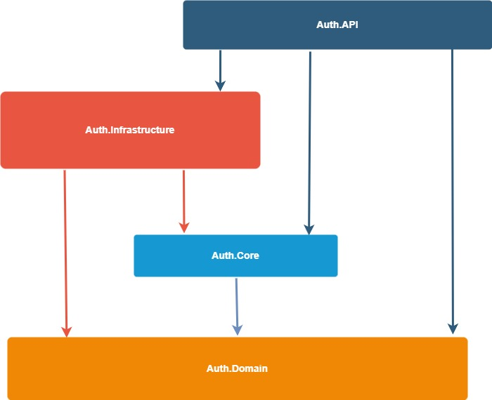

 

# Clean Architecture AuthApi

REST API demonstrates **Authentication** and **Authorization** with **JWT token**. Also shows how to use diferent **Authorization policies** in minimap api endpoints. All using Clean Architecture, minimal API and various of design patterns.

Example API allows to: 
 * **register** user
 * **login** user
 * **change user role**
 * get user and service info

Endpoints use different types of authorization policies.

# Menu
* [Get Started](#get-started)
* [Motivation](#motivation)
* [Architecture](#architecture)
* [Technologies](#technologies)

# Get Started

Simply Run **Auth.API** and try it.

# Motivation
Main motivation is to write practical example of Authorization and Authentication with minimal API and Clean Architecture.

# Architecture

Projects folows **[Clean Architecture](https://learn.microsoft.com/en-us/dotnet/architecture/modern-web-apps-azure/common-web-application-architectures#clean-architecture)**, but application layer is splitted to Core and Domain projects where Core project holds business rules and Domain project contains business entities.

As Minimal API allows to inject handlers into endpoint map methods, I decided to do not use **[MediatR](https://github.com/jbogard/MediatR)**, but still every endpoint has its own request and handler. Solution folows **[CQRS pattern](https://learn.microsoft.com/en-us/azure/architecture/patterns/cqrs)**, it means that handlers are separated by commands and queries, command handlers handle command requests and query handlers handle query requests. Also repositories (**[Repository pattern](https://learn.microsoft.com/en-us/aspnet/mvc/overview/older-versions/getting-started-with-ef-5-using-mvc-4/implementing-the-repository-and-unit-of-work-patterns-in-an-asp-net-mvc-application)**) are separated by command and queries.

Instead of throwing exceptions, project use **[Result pattern](https://www.forevolve.com/en/articles/2018/03/19/operation-result/)** (using [FluentResuls package](https://github.com/altmann/FluentResults)) and for returning exact http response, every handler returns data wraped into HttpDataResponse object which contains also error messages collection and http response code.

#### Clean Architecture Layers

Solution contains four layers: 
* **Auth.Api** - entry point of the application, top layer
	*  Endpoints
	*  Middlewares (or Filters)
	*  API Configuration
* **Auth.Infrastructure** - layer for communication with external resources like database, cache, web service.. 
	*  Repositories Implementation - access to database
	*  External Services Proxies - proxy classes implementation - to obtain data from external web services
	*  Infastructure Specific Services - services which are needed to interact with external libraries and frameworks
* **Auth.Core** - business logic of the application
	*  Request Handlers/Managers/.. - business implementation
	*  Abstractions - besides abstractions for business logic are there abstractions for Infrastructure layer (Service, Repository, ..) to be able use them in this (core) layer
* **Auth.Domain** - all what should be shared across all projects
	* DTOs
	* General Extensions

#### Horizontal Diagram (references)

## Technologies
* [ASP.NET Core 7](https://learn.microsoft.com/en-us/aspnet/core/introduction-to-aspnet-core?view=aspnetcore-7.0)
* [Entity Framework Core InMemory](https://learn.microsoft.com/en-us/ef/core/providers/in-memory/?tabs=dotnet-core-cli)
* [Mapster](https://github.com/MapsterMapper/Mapster)
* [FluentResuls](https://github.com/altmann/FluentResults)
* [Validot](https://github.com/bartoszlenar/Validot)
* [GuardClauses](https://github.com/ardalis/GuardClauses)
* [Moq](https://github.com/moq/moq4)
* [Xunit](https://github.com/xunit/xunit)
