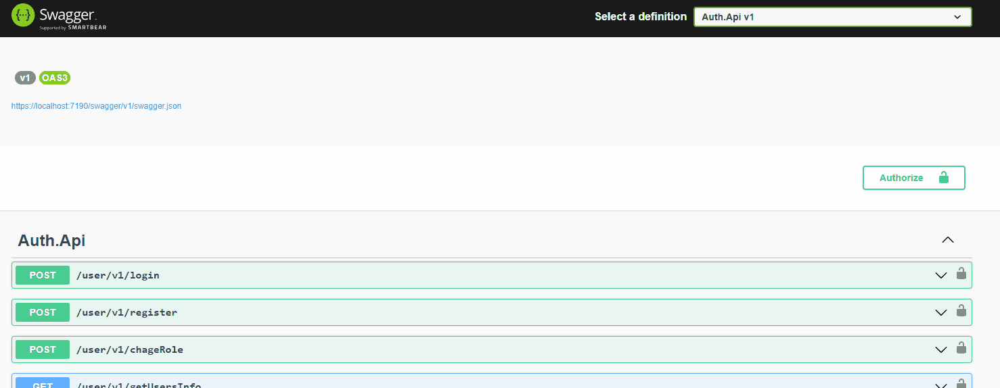

<div align="center">


# Clean Architecture AuthApi

[](https://github.com/Gramli/AuthApi/actions/workflows/dotnet.yml)
[](https://github.com/Gramli/AuthApi/actions/workflows/angular.yml)


[](LICENSE.md)

⭐ If you like this project, star it on GitHub — it helps a lot!

[Overview](#overview) • [Features](#features) • [Getting started](#getting-started) • [Architecture](#architecture) • [Technologies](#technologies)

</div>

A full-stack authentication and authorization solution demonstrating Clean Architecture principles with .NET 10 and Angular 21. This project showcases multiple authentication methods (JWT Bearer and Basic Authentication), role-based access control, and modern frontend patterns.

## Overview

This application demonstrates enterprise-grade authentication and authorization patterns using a clean architecture approach. The backend implements **dual authentication schemes** (JWT Bearer tokens and Basic Authentication) with **minimal APIs**, while the frontend showcases modern Angular practices with standalone components and signals.

**Key capabilities:**
- User registration and login with JWT tokens
- Basic Authentication for service-to-service or admin access
- Role-based authorization with custom policies
- Custom claims middleware
- HTTP response caching
- Angular guards and interceptors for client-side auth

> [!TIP]
> The project uses in-memory Entity Framework for quick setup and testing. Perfect for learning and prototyping!

## Features

### Authentication Methods

- **JWT Bearer Authentication**: Secure token-based authentication for user sessions with configurable expiration and validation
- **Basic Authentication**: HTTP Basic auth scheme for service accounts, admin tools, or simple API access
- **Swagger Integration**: Pre-configured UI with support for both authentication methods, allowing easy API testing

### Application Features

- **CQRS Pattern**: Command-Query separation without the complexity of MediatR
- **Result Pattern**: No exceptions for flow control; uses [FluentResults](https://github.com/altmann/FluentResults) for explicit error handling
- **Response Caching**: HTTP response caching configured via extension methods
- **Custom Claims Middleware**: Dynamically enriches user claims during request processing
- **In-Memory Database**: Entity Framework Core InMemory provider for quick setup and testing
- **Standalone Components**: Modern Angular architecture without NgModules
- **Signals**: Reactive state management with Angular signals
- **JWT Token Management**: Automatic token storage and injection via interceptors
- **Route Guards**: Protect routes based on authentication state
- **PrimeNG UI**: Professional UI components with PrimeFlex layout utilities

## Getting started

### Prerequisites

- **.NET SDK 10.0+** - [Download](https://dotnet.microsoft.com/download)
- **Node.js 24.11.x+** - [Download](https://nodejs.org/)
- **Angular CLI 21+** - Install via `npm install -g @angular/cli`
- **IDE**: Visual Studio 2019+, JetBrains Rider 2024.2.7+, or VS Code

### Installation

1. Clone the repository:
   ```bash
   git clone https://github.com/Gramli/AuthApi.git
   cd AuthApi/src
   ```

2. Install backend dependencies:
   ```bash
   dotnet restore
   ```

3. Install frontend dependencies:
   ```bash
   cd Auth.Frontend
   npm install
   ```

### Running the application

#### Run both backend and frontend:

1. **Start the backend**:
   ```bash
   # From the src directory
   dotnet run --project Auth.Api/Auth.Api.csproj
   ```
   The API will be available at `https://localhost:7190` or `http://localhost:5166`.

2. **Start the frontend** (in a new terminal):
   ```bash
   # From the Auth.Frontend directory
   ng serve
   ```
   Navigate to [http://localhost:4200](http://localhost:4200) in your browser.


#### Test using Swagger UI:

1. Open your IDE (Visual Studio or Rider) and run the **Auth.Api** project
2. Navigate to the Swagger UI (automatically opens, or go to `/swagger`)
3. Authenticate using either method:

   **Option 1: JWT Bearer Authentication**
   - Use the `/api/auth/login` endpoint to get a JWT token
   - Click the "Authorize" button and select "Bearer"
   - Enter the token in the format: `Bearer <your-token>`

   **Option 2: Basic Authentication**
   - Click the "Authorize" button and select "Basic"
   - Enter credentials (default: username: `admin`, password: `admin`)
   - Configured in `appsettings.json` under `Authentication:Schemes:Basic`

4. Try the protected endpoints with your chosen authentication method



> [!NOTE]
> Basic Authentication credentials can be configured in [appsettings.json](src/Auth.Api/appsettings.json) under the `Authentication:Schemes:Basic` section.

#### Test using .http files:

1. Navigate to `Tests/HttpDebugTests/debug-tests.http`
2. Send the Login request to obtain a JWT token
3. Copy the token from the response
4. Use the token in subsequent requests by adding it to the `Authorization` header:
   ```http
   Authorization: Bearer <your-token>
   ```

Alternatively, test Basic Authentication by adding:
```http
Authorization: Basic YWRtaW46YWRtaW4=
```
(Base64 encoded `admin:admin`)

## Architecture

This project follows **Clean Architecture** principles with clear separation of concerns.

### Design patterns and decisions

**CQRS without MediatR**: Minimal APIs support direct handler injection, eliminating the need for a mediator library. Handlers are split into commands (writes) and queries (reads).

**Result Pattern**: Uses [FluentResults](https://github.com/altmann/FluentResults) instead of exceptions. Each handler returns an `HttpDataResponse` containing data, error messages, and HTTP status codes.

**Validation**: [Validot](https://github.com/bartoszlenar/Validot) provides declarative, performant validation rules integrated via dependency injection.

**Mapping**: [Mapster](https://github.com/MapsterMapper/Mapster) handles object-to-object mapping with high performance and low ceremony.

### Backend features

- **Dual Authentication**: Both JWT Bearer and Basic Authentication schemes configured and available simultaneously
- **Authorization Policies**: Different endpoints demonstrate various policy-based authorization patterns
- **Response Caching**: Extension method `AddResponseCachePolicy` adds HTTP response caching to endpoints
- **Claims Middleware**: `ClaimsMiddleware` dynamically enriches user claims during request processing
- **In-Memory Database**: Entity Framework Core InMemory provider for quick setup and testing

### Frontend architecture

The Angular frontend is organized into:

- **Core**: Feature components with specific business logic (login, register, user management)
- **Shared**: Reusable components, services, guards, and interceptors

**JWT Token Flow**:
1. User logs in via API
2. `JwtTokenService` stores token in local storage
3. `AuthorizeGuard` protects routes by checking token presence
4. `authInterceptor` automatically adds `Authorization` header to all HTTP requests

## Technologies

**Backend**:
- [ASP.NET Core 10](https://learn.microsoft.com/en-us/aspnet/core/introduction-to-aspnet-core?view=aspnetcore-10.0) - Minimal APIs
- [Entity Framework Core InMemory](https://learn.microsoft.com/en-us/ef/core/providers/in-memory/?tabs=dotnet-core-cli) - Data persistence
- [Mapster](https://github.com/MapsterMapper/Mapster) - Object mapping
- [SmallApiToolkit](https://github.com/Gramli/SmallApiToolkit) - API utilities
- [FluentResults](https://github.com/altmann/FluentResults) - Result pattern
- [Validot](https://github.com/bartoszlenar/Validot) - Validation
- [GuardClauses](https://github.com/ardalis/GuardClauses) - Defensive programming

**Frontend**:
- [Angular 21](https://angular.dev) - Framework with standalone components
- [PrimeNG](https://primeng.org) - UI component library
- [PrimeFlex](https://primeflex.org) - CSS utility framework
